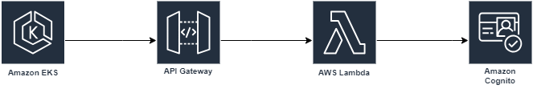

# Quick Serve Auth

Este é um repositório para o projeto Quick Serve Auth.

Projeto AuthCognito com AWS Lambda e API Gateway
Este projeto consiste em criar uma AWS Lambda chamada authcognito em Python 3.12, que faz uso do serviço AWS Cognito e é integrada com o AWS API Gateway. Vamos detalhar os passos necessários para configurar tudo isso.

## Infraestrutura:

**Integração Conta AWS**: Neste repositório está configurado nos secrets AWS_ACCESS_KEY_ID e AWS_SECRET_ACCESS_KEY para que o terraform acesse a conta AWS e crie a infraestrutura automaticamente. 

**Terraform**: Vamos usar o Terraform para criar a infraestrutura automaticamente. Ele está configurado na pasta .github/workflows/terraform.yml

**GitHub Actions**: Para automatizar a criação da Lambda e do API Gateway, é utilizado o GitHub Actions para CI/CD.

## Peças criadas nesse repositório:
**Lambda Function**:
Função Lambda em Python 3.12 que recebe requisições do API Gateway numa URL definida e dependendo da requisição interage de formas diferentes com o AWS Cognito. Quando a lambda recebe uma requisição com o método (GET) ela busca o usuário informado na requisição no User Pool de usuários da plataforma e caso ele exista, retorna os dados complementares de seu cadastro.
Quando a lambda recebe uma requisição com o método (POST) ela busca o usuário informado na requisição no User Pool de usuários da plataforma e caso ele exista, retorna os dados complementares de seu cadastro e caso não exista, ela faz a criação do mesmo.

A integração da lambda com as requisições do API Gateway foram facilitadas por usarem AWS Powertools (python). 

**API Gateway**:

O AWS API Gateway é um serviço que permite a criação, publicação, manutenção, monitoramento e proteção de APIs REST. Ele é utilizado para expor um endpoint e realizar a integração com a lambda para que seja possível fazer o gerenciamento dos usuários no AWS Cognito. 

## Arquitetura:

## Documentação:
[AWS Lambda Documentation](https://aws.amazon.com/pt/pm/lambda/)

[AWS Powertools (python)](https://docs.powertools.aws.dev/lambda/python/latest/core/event_handler/api_gateway/)

[AWS Cognito Documentation](https://aws.amazon.com/pt/cognito/?nc2=type_a)

[API Gateway Documentation](https://aws.amazon.com/pt/api-gateway/?nc2=type_a)

[Terraform Documentation](https://registry.terraform.io/providers/hashicorp/aws/latest/docs)

[GitHub Actions Documentation](https://docs.github.com/pt/actions)

